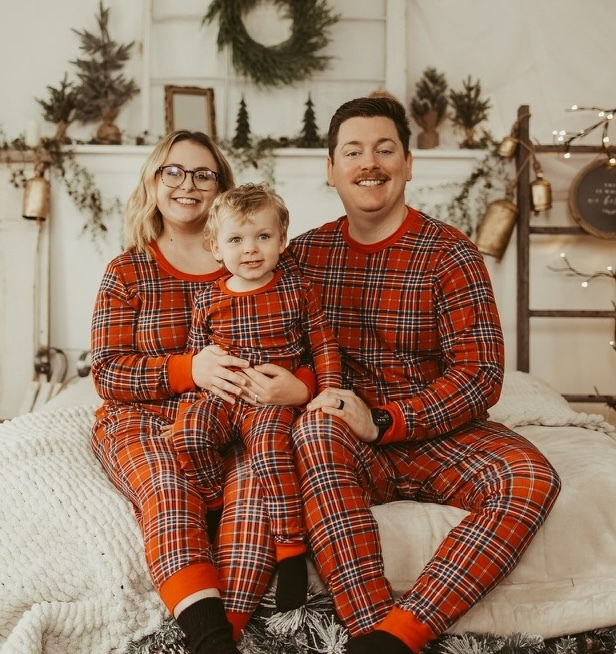

<!--

Ryan Miller's Personal User Manual

--- Notes ---

I originally made this with Marp. Marp is nice, but it generates a 40 MB PDF!
Dude...

So I took the Marp Markdown file and converted to HTML with Pandoc. Then, I
manually added table, tr, and td tags. The result is a GitHub Markdown
compatible file that renders a bunch of tables that look like slides.

GitHub Markdown doesn't support much styling. To set the table size correctly so
it looks like a slideshow, I had to set height each tr and the width on each td
element. I had to do everything in pixels. It doesn't work if you set width on a
tr and attempt to use % values for the td.

-->

---

  <h3> ⤵️ ⤵️ Mobile? Flip your phone landscape. ⤵️ ⤵️</h3>
  (This document was converted from a slide deck converted to save bandwidth. It renders weird on small screens.)

---

 

<table align="center">
  <tr height="500px">
    <td width="510px">
      <h1 id="ryan-millers-personal-user-manual">
        Ryan Miller’s
         
        <a href="https://openpracticelibrary.com/practice/personal-user-manuals">Personal User Manual</a> 👋
      </h1>
      <ul>
        <li><strong>This document helps you get to know me and how I operate.</strong></li>
        <li>Software without a solid manual is worthless.</li>
        <li>Why not have a user manual for people?</li>
        <li>Concept from the <a href="https://openpracticelibrary.com">Open Practice Library</a></li>
      </ul>
    </td>
    <td align="center" width="340px">
      
    </td>
  </tr>
</table>

<table align="center">
  <tr height="500px">
    <td width="850px">
      <h1 id="table-of-contents">Table of Contents 🧭</h1>
      <ul>
        <li><a href="#ryan-miller">Me! 🧑‍💻</a></li>
        <li><a href="#location">Logistics 🌎</a></li>
        <li><a href="#random-fun-facts">Fun Stuff 🎉</a></li>
      </ul>
    </td>
  </tr>
</table>

<table align="center">
  <tr height="500px">
    <td width="510px">
      <h1 id="ryan-miller">Ryan Miller 🧍🏻</h1>
      <ul>
        <li>30s</li>
        <li>Married 👩‍❤️‍👨</li>
        <li>2 kids 👦🏼 👶🏻</li>
        <li>2 dogs 🐶 🐶</li>
        <li>GitHub: <a href="https://github.com/RyanMillerC">@RyanMillerC</a></li>
        <li>I’m on <a href="https://www.linkedin.com/in/millerryanc">LinkedIn</a></li>
      </ul>
    </td>
    <td width="340px">
      
    </td>
  </tr>
</table>

<table align="center">
  <tr height="500px">
    <td width="850px">
      <h1 id="work-experience">Professional Experience 💼</h1>
      <ul>
        <li><strong>Owner and Principal Architect</strong> @ <a href="https://automatedscalablesolutions.com">Automated Scalable Solutions</a></li>
        <li>10+ years professional experience</li>
        <li>5+ years experience in leadership roles</li>
        <li>Led IT service delivery across Aeronautics, Commercial, Financial, Healthcare, and Public Sector clients</li>
        <li>Previously worked for the U.S. Federal Government 🏛️, Hashicorp, IBM, Red Hat, and small/med-sized I.T. contractors</li>
        <li>Wear many hats 🧢 (AppDev, Architect, DevOps, Platform Engineering, and SRE)</li>
      </ul>
    </td>
  </tr>
</table>

<table align="center">
  <tr height="500px">
    <td width="550px">
      <h1 id="technical-experience">Technical Experience 👨🏻‍💻</h1>
      <ul>
        <li>
          <strong>Subject Matter Expert</strong> in
          Ansible (AAP),
          Containers,
          Kubernetes,
          Platform Engineering (PaaS),
          Release Engineering (CI/CD, DevSecOps, GitOps),
          Red Hat OpenShift,
          RHEL,
          and Shell Scripting
        </li>
         
        <li>
          <strong>Experienced</strong> with
          AppDev,
          Amazon Web Services (AWS),
          Argo CD (OpenShift GitOps),
          HashiCorp Terraform,
          HashiCorp Vault,
          Helm,
          Red Hat ACM,
          Red Hat ACS,
          Red Hat Quay,
          and Red Hat SSO (Keycloak)
        </li>
         
        <li><strong>I don't know everything!</strong> I work with my team to fill experience gaps and validate edge cases.
      </ul>
    </td>
    <td width="300px" valign="middle" align="center">
      
    </td>
  </tr>
</table>

<table align="center">
  <tr height="500px">
    <td width="550px">
      <h1 id="certifications">Certifications 🎓</h1>
      <ul>
        <li><a href="https://www.credly.com/badges/a2465e45-c128-4a74-b16b-fc0fcfefade4">AWS Certified Solutions Architect - Associate</a></li>
        <li><a href="https://www.credly.com/badges/bdcebd68-0347-4927-993a-2829a50b6e0b">CompTIA Security+</a></li>
        <li><a href="https://www.credly.com/badges/cce07910-a6bf-425c-ac40-422e9eadc537">Red Hat Certified Architect (RHCA)</a></li>
        <li><a href="https://www.credly.com/badges/cce07910-a6bf-425c-ac40-422e9eadc537">Red Hat Certified Engineer (RHCE)</a></li>
        <li>
          Red Hat Certified Specialist in
          <a href="https://www.credly.com/badges/cce07910-a6bf-425c-ac40-422e9eadc537">API Management</a>,
          <a href="https://www.credly.com/badges/cce07910-a6bf-425c-ac40-422e9eadc537">Containers and Kubernetes</a>,
          <a href="https://www.credly.com/badges/cce07910-a6bf-425c-ac40-422e9eadc537">MultiCluster Management</a>,
          <a href="https://www.credly.com/badges/cce07910-a6bf-425c-ac40-422e9eadc537">OpenShift Administration</a>, and
          <a href="https://www.credly.com/badges/cce07910-a6bf-425c-ac40-422e9eadc537">OpenShift Application Development</a>
        </li>
        <li><a href="https://www.credly.com/badges/cce07910-a6bf-425c-ac40-422e9eadc537">Red Hat Certified System Administrator (RHCSA)</a></li>
      </ul>
       
      (Pretty much all of these expired...  🥲. I want to renew them.)
    </td>
    <td width="300px" valign="middle" align="center">
      
    </td>
  </tr>
</table>

<table align="center">
  <tr height="500px">
    <td width="550px">
      <h1 id="location">Location 🗺️</h1>
      <ul>
        <li>Remote, located in West Virginia (WV)</li>
        <li>
          Close enough to make a day trip for meetings 🤝, meals 🍜, or beers 🍺.
          <ul>
            <li>45 Minutes from <strong>Fredrick, MD</strong></li>
            <li>1 hour from <strong>Leesburg, VA</strong></li>
            <li>1 hour, 45 minutes from <strong>Washington D.C.</strong></li>
          </ul>
        </li>
      </ul>
    </td>
    <td width="300px" valign="middle" align="center">
      
    </td>
  </tr>
</table>

<table align="center">
  <tr height="500px">
    <td width="550px">
      <h1 id="scheduling-and-meetings">Scheduling and Meetings 🗓️</h1>
      <ul>
        <li><strong>Eastern Time Zone (EST/EDT)</strong></li>
        <li>I try to schedule all meetings between <strong>9 AM - 4 PM ET</strong>.</li>
        <ul>
          <li>I manage multiple calendars</li>
          <li>I try to keep them up to date but sometimes events don't get synced.</li>
          <li><strong>If you see a free spot on my calendar- grab it!</strong></li>
        </ul>
        <li>If I email or message you outside of your working hours, please don’t feel obligated to reply right away!</li>
      </ul>
    </td>
    <td width="300px" valign="middle" align="center">
      
    </td>
  </tr>
</table>

<table align="center">
  <tr height="500px">
    <td width="510px">
      <h1 id="random-fun-facts">(Random) Fun Facts! 🤪</h1>
      <ul>
        <li>I wear fun tee shirts everyday ➡️️️</li>
        <li>I also wear Crocs 🐊 (See slide [#3](#ryan-miller))</li>
        <li>I love Mexican food 🌮</li>
        <li>I have a tattoo of a Bash fork bomb <code>:(){ :|:&amp; };:</code></li>
        <li>I'm lucky 🍀 - Once won ~$50,000 in an office lottery pool</li>
        <li>I've watched <em>The Office (US)</em> TV series at least 3 times through</li>
      </ul>
    </td>
    <td width="340px">
      
    </td>
  </tr>
</table>

<table align="center">
  <tr height="500px">
    <td width="850px">
      <h1 id="cool-tech-stuff-ive-done">Cool Tech Stuff I’ve Done! 🚀</h1>
      <ul>
        <li>
          Built out an iPad app and backend for U.S. Coast Guard vessel inspections
          <ul>
            <li>React Native with .NET Framework (C#) backend</li>
            <li>Authentication via virtual key derived from a user’s physical smart-card! 🔑</li>
          </ul>
        </li>
        <li>
          Created my own OpenShift Operator
          <ul>
            <li><a href="https://github.com/RyanMillerC/cat-facts-operator">cat-facts-operator</a> - An operator for all you cool cats and kittens! 😸</li>
          </ul>
        </li>
        <li>
          Written packages for Vim and Emacs 🤓
          <ul>
            <li><a href="https://github.com/RyanMillerC/better-vim-tmux-resizer">better-vim-tmux-resizer</a> - Way better than the original vim-tmux-resizer</li>
            <li><a href="https://github.com/RyanMillerC/poke-line">poke-line</a> - Add Pokémon to Emacs!</li>
          </ul>
        </li>
        <li>Made a Google Chat bot based off early-2000's Microsoft Office <i>Clippy</i>. (His name is <i>Certy</i>!)</li>
      </ul>
    </td>
  </tr>
</table>

<table align="center">
  <tr height="500px">
    <td width="510px">
      <h1 id="stuff-im-into">Stuff I’m Into 🔥</h1>
      <ul>
        <li>Astrophotography 🌠</li>
        <li>Formula 1 🏎️</li>
        <li>Golf 🏌🏻 and Disc Golf 🥏</li>
        <li>Homelab 🔌</li>
        <li>Mechanical Keyboards ⌨️</li>
        <li>Music (I play guitar 🎸 and drums 🥁)</li>
        <li>Smoking Food (and grilling food too!) 👨‍🍳</li>
        <li>Snowboarding 🏂</li>
        <li>Weightlifting 🏋🏻</li>
      </ul>
    </td>
    <td width="340px">
      
    </td>
  </tr>
</table>

<!-- Removing slide for now. I started doing astrophotography, so... 😃
<table align="center">
  <tr height="500px">
    <td width="340px">
      
    </td>
    <td width="510px">
      <h1 id="stuff-i-want-to-get-into-or-more-into">
        Stuff I <em>Want</em> to Get Into   (Or More Into)
      </h1>
      <ul>
        <li>
          <strong>Astrophotography</strong> 🌠
          <ul>
            <li>Space is cool! I know nothing about telescopes. Hit me up if you do...</li>
          </ul>
        </li>
        <li>
          <strong>Retro Video Game Mechanics and Development</strong> 📺
          <ul>
            <li>Game Boy, SNES, etc.</li>
          </ul>
        </li>
        <li>
          <strong>Whiskey!</strong> 🥃
          <ul>
            <li>Recommend me whiskey to try!</li>
          </ul>
        </li>
      </ul>
    </td>
  </tr>
</table>
-->

<table align="center">
  <tr height="500px">
    <td width="510px">
      <h1 id="in-conclusion">In Conclusion 🎬</h1>
      <ul>
        <li>I look forward to working with you!</li>
      </ul>
    </td>
    <td align="center" width="340px">
      
    </td>
  </tr>
</table>
